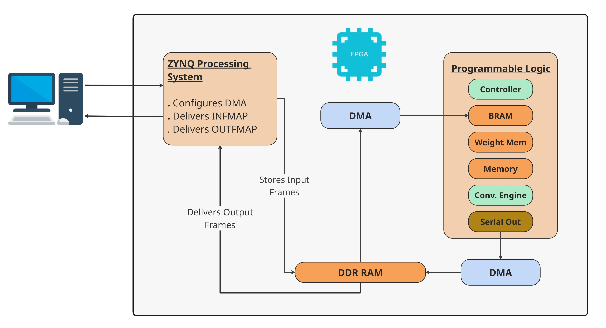

# FPGA-Based User-Configurable CNN Accelerator

## Overview
Object detection is a critical technology for autonomous systems, medical imaging, and defense applications. However, the deep learning models underpinning these systems impose high computational demands, creating a bottleneck for deployment on resource-constrained edge devices. Field Programmable Gate Arrays (FPGAs) offer a viable solution due to their massive parallelism, low latency, and energy efficiency. This work presents a user-configured FPGA accelerator architecture designed specifically for real-time YOLOv8n inference. The proposed architecture features an Input stationary architecture with weight broadcasting that handles convolution using three kinds of shift mechanism that dynamically reconfigures hardware resources to balance throughput and accumulation depth based on layer characteristics. Furthermore the design operates entirely on-chip, eliminating the need for off-chip memory accesses during computation and thereby minimizing latency and power consumption. Utilizing FP16 precision, the system enables direct deployment from high-level software APIs to the hardware fabric. While the underlying architecture remains fully scalable and feasible for the complete YOLOv8n model, resource constraints limit the current implementation. Therefore, as a proof of concept, this project executes the first few convolutional layers on the FPGA to demonstrate the accelerated speedup. Experimental results from these initial layers prove that this architecture successfully bridges the gap between high-performance object detection and the strict constraints of edge computing.

This project implements a **closed-loop, FPGA-based Convolutional Neural Network (CNN) accelerator** designed to efficiently perform convolution operations while maximizing the utilization of FPGA **Programmable Logic (PL)**.

  
   
  <em>Accelerator Architecture</em>

---

## Architecture Components

  
   
  <em>Accelerator Architecture</em>

### Processing Element (PE)
The **Processing Element (PE)** is the fundamental computation unit.

Each PE contains:
- 1 × FP16 Multiplier
- 2 × FP16 Adders

The multiplier performs element-wise multiplication between input features and weights, while the adders accumulate partial results. Multiple PEs work in parallel to compute convolution efficiently.

---

### Convolution Engine (CE)
The **Convolution Engine (CE)** is the core computation block, consisting of an **8 × 8 array of PEs**.

It performs convolution using two key shifting mechanisms:

#### Horizontal Shift (hor_shift)
- Moves data across rows of the PE array
- Ensures values in the same row are accumulated correctly
- Enables reuse of input data across columns
- Supports continuous streaming of data

#### Vertical Shift (ver_shift)
- Moves data across columns of the PE array
- Ensures vertically aligned values (kernel window) are accumulated
- Completes the sliding window behavior of convolution

Together, these shifts enable correct mapping of inputs and weights for convolution.

---

### Super Convolution Engine (Super CE)
The **Super CE** extends the Convolution Engine functionality.

In addition to convolution, it can support:
- Activation functions (e.g., ReLU)
- Pooling operations (e.g., max pooling)

This allows multiple CNN operations to be executed within the same hardware block, reducing data movement and improving efficiency.

---

### CE Wrapper (Engine Shift Mechanism)
The wrapper connects multiple CEs / Super CEs and introduces the **engine shift** mechanism.

Purpose:
- Handle multi-channel (depth-wise) convolution

Working:
1. One CE processes part of the input depth
2. Produces partial results
3. Passes results to the next CE
4. Next CE accumulates its results with received data
5. Process continues across all engines

This enables efficient accumulation across depth without excessive memory access.

---

### Mask Generator
The **Mask Generator** identifies valid outputs from the 8 × 8 PE array.

- Not all outputs are valid due to kernel size and stride
- Generates a mask indicating valid positions
- Ensures only correct convolution outputs are used

---

### Valid Data Module
The **Valid Data** module applies the mask.

- Keeps valid outputs
- Replaces invalid outputs with zeros

This ensures clean and correct data propagation.

---

### Memory Architecture
The memory system is designed for high-throughput data feeding.

- 3 Buffers (each serving one CE)
- Each buffer contains 15 memory banks
- Each bank is 32 bits wide
- Each bank feeds 4 PEs (FP16 inputs)

Key Features:
- Parallel data access
- High bandwidth
- Configurable depth (based on FPGA resources)

---

### Controller (FSM-Based)
The **Controller** is the main control unit implemented as a **Finite State Machine (FSM)**.

Responsibilities:
- Control input and weight flow
- Generate control signals for:
  - Horizontal shift
  - Vertical shift
  - Engine shift
- Manage memory operations
- Synchronize all modules

Features:
- Fully reconfigurable
- Supports different kernel sizes, strides, and input dimensions
- Adapts to different CNN configurations without redesign

---

### Weight Memory
The **Weight Memory** module stores and distributes kernel weights.

Features:
- Efficient weight broadcasting to PEs
- Configured based on output channel depth
- Automatically provides correct weights per channel
- Eliminates need for manual addressing per kernel

---

## Key Features
- Closed-loop architecture for efficient data reuse
- High parallelism using 8 × 8 PE array
- Support for multi-channel convolution
- Reconfigurable design
- Optimized memory bandwidth usage
- Extensible to full CNN pipeline (Conv + Activation + Pooling)

  
   
  <em>Accelerator Architecture</em>

---
